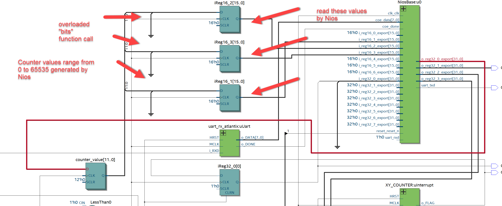
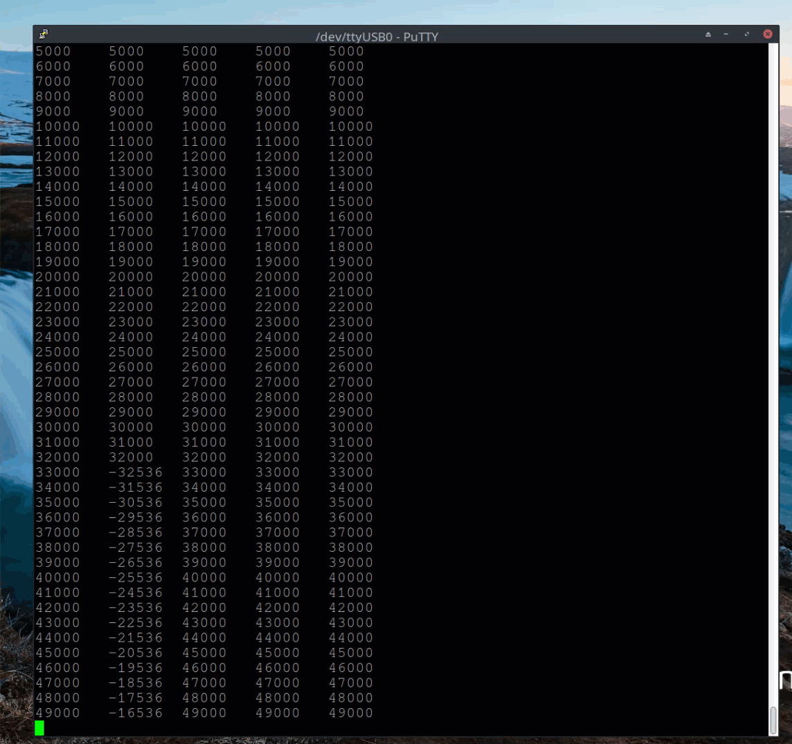

# monitorX
An example of using Nios to monitor to FPGA operations in VHDL. 

## Background 

The Nios softcore processor is instantiated inside of a Quartus design
to examine the effects of an overloaded VHDL function on a register. 
For example, Nios does the following:

 1. Writes a value to an output register
 2. This register is then converted to signed, unsigned, and std_logic_vector type
 3. The VHDL overloaded "bits" function is then applied to these three signals
 4. Nios then reads these signals back in along with the original value written

## VHDL Overloading

In general, VHDL allows for function overloading with *unique arguments* however in
this design the arguments are *not unique* for the "bits" function. So this is a 
fundamental issue with the compiler versus the VHDL specification. 

## Hardware Testbed

The highly popular DE10-Nano from Terasic was used to test the code. The logic
portion of the device was used with Nios, and the hard processor side was not
used at all. The design was synthesized with Quartus 20.1 on Windows 10. 

The general structure as to how the designw as setup is shown below. The output
reg from Nios is highlighted in red, and there are three versions of that
value (operated on by the "bits" function) read back in my Nios.

## Running the Test

Putty was used as a terminal emulator, and the C code writes values in a loop 
and reads them each time. In the GIF below, 

 1. reg1 is the signed value
 2. reg2 is the unsigned value
 3. reg3 is the std_logic_value
 4. reg4 is the original value written (readback)

## Summary and Conclusions

The general results seem to indicate that the bits function is okay when running
in real time, however, upon power up/reset conditions, the bits function was 
found to give conflicting results. Addittionally the program should not be allowed
to compile without throwin an error, according to the author's understanding of the
IEEE standard VHDL. 
